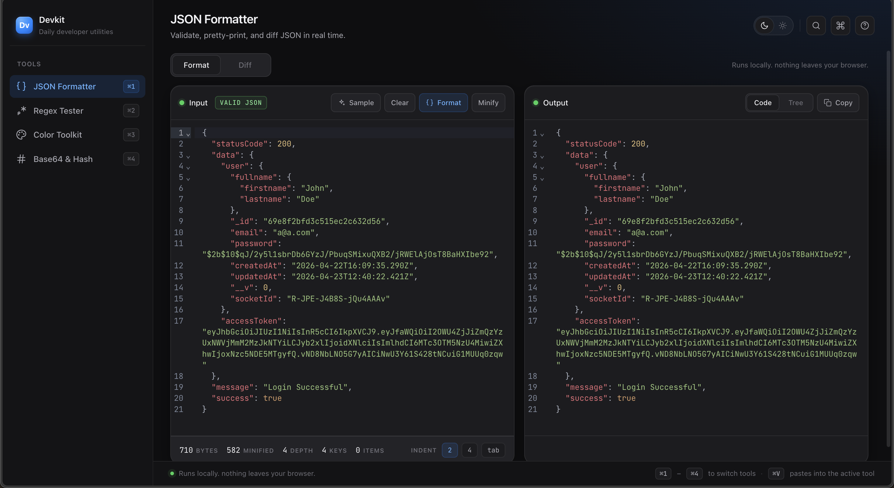
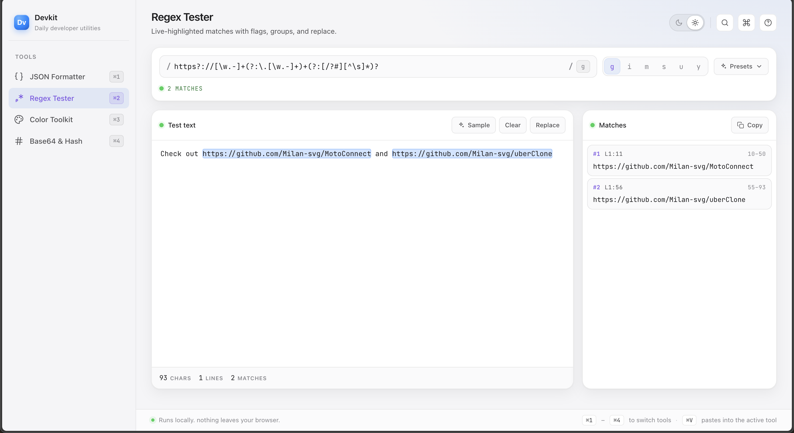
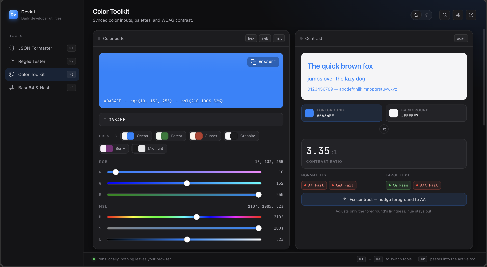

# DevKit

A small, fast browser toolbox I made for everyday dev tasks.

Built as a portfolio project.

https://dev-kit-gray.vercel.app/

## Tools

### JSON Formatter & Validator

- Validates JSON as you type and points at the exact line + column when something breaks
- Pretty-print, minify, or browse it as a collapsible tree
- Diff mode for comparing two blobs side by side

### Regex Tester

- Type `/pattern/flags` and matches light up in the text as you go — click one to jump there
- Replace mode with `$1` / `$2` / named-group substitution and a live preview
- Presets for the patterns you keep googling — email, UUID, SemVer, hex colour, etc.

### Color Toolkit

- Paste any CSS color (hex, rgb, hsl, named) and edit it in all three formats at once
- Live WCAG contrast preview with a one-click nudge to make text pass AA
- Builds a shade scale and harmony palettes; copy any swatch as CSS variables

### Base64 & Hash

- **Encode / Decode** — Base64 (URL-safe variant included), URL components, and HTML entities; flip direction with one button
- **Hashing** — MD5 and SHA-1 / 256 / 512 over text or a dropped file, plus a compare panel
- **JWT decoder** — decodes header + payload, annotates each claim, and flags expired or not-yet-valid tokens (signature is not verified)

## Keyboard

| Shortcut                         | Action                                     |
| -------------------------------- | ------------------------------------------ |
| `⌘1`–`⌘4` (or `Ctrl+1`–`Ctrl+4`) | Switch tool                                |
| `⌘V` (or `Ctrl+V`)               | Paste into the active tool's primary input |

## Stack

| React 19 + Vite | UI + build |
| Tailwind v4 | base reset; styling is CSS custom properties in `src/index.css` |
| framer-motion | tool / mode transitions |
| @uiw/react-codemirror + @codemirror/lang-json + @codemirror/theme-one-dark | JSON editing |
| crypto-js (MD5), Web Crypto (SHA) | hashing |
| js-base64 | Base64 / Base64URL |
| json5 | lenient JSON fallback |
| sonner | toast notifications |
